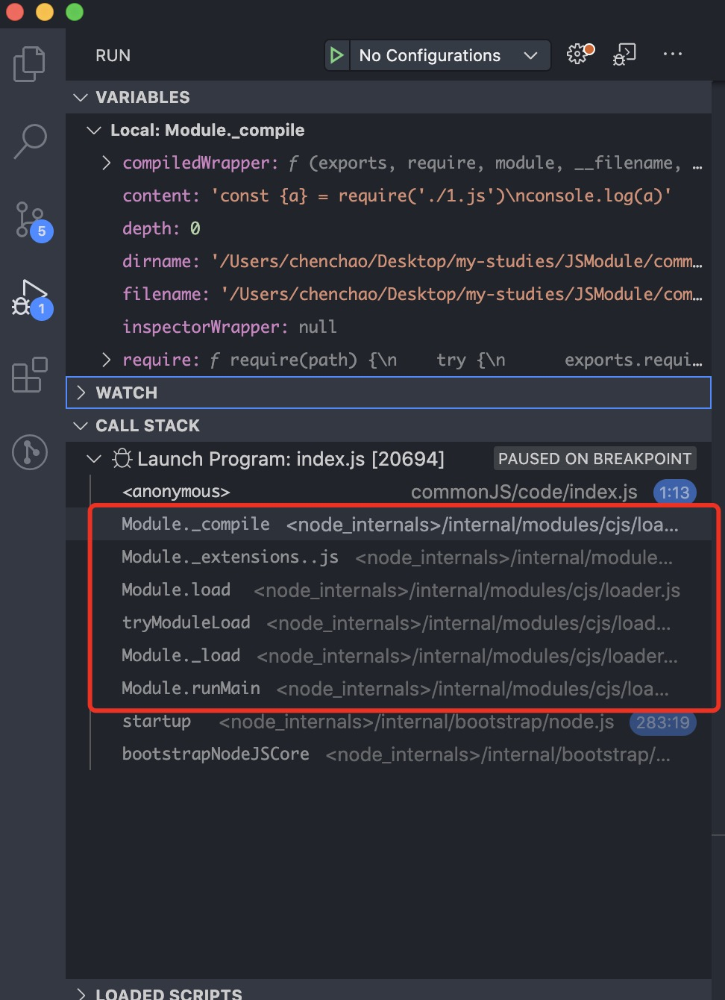

参考：http://nodejs.cn/api/modules.html#modules_all_together

`commonJS`定义了模块加载的规范，主要是两个函数：

- `module`：导出模块
- `require`：导入模块

由于`ECMAScript`不支持两个函数，所以**不支持在浏览器中使用**。

使用`CommonJS`在执行模块代码时，**会将代码包装在一个函数内部**，避免作用域的污染：

```javascript
(function(exports, require, module, __filename, __dirname) {
  // exec
})
```

## require

`require`用于加载模块，加载模块时读入并执行文件，然后返回模块的`exports`对象。

```js
const moduleA = require('moduleA')
const moduleB = require('./moduleB')
const moduleC = require('/Users/xx/moduleB')
```

导入模块的语法非常简单，对于`nodeJS`的原生模块以及`node_modules`中的模块可以直接输入模块的名称，对于自定义模块可以使用模块的相对路径或者绝对路径。

1. 如果在使用`require`时路径以`/`开头，则是加载绝对路径下的文件模块。
2. 如果在使用`requier`时路径以`./`、`../`开头则加载相对路径（相对于当前脚本执行的位置）下的模块。
3. 如果在使用`require`时路劲不以`/`、`./`、`../`开头，则表示加载一个核心模块或者`node_modules`中的模块。**在加载首先会在`/usr/local/lib/node`目录下加载核心模块；然后才是从当前的`node_modules`加载已安装的模块，如果当前`node_modules`没有找到则在父级的`node_modules`中查找，直到根目录。**

在加载模块的过程，**第一次加载会将该模块放在缓存中，后续直接从缓存中读取**。并且如果在加载时没有发现指定的文件模块，`Node`会尝试给文件加上`.js .json .node .mjs`后缀。

打印`require`：

```js
[Function: require] {
  resolve: [Function: resolve] { paths: [Function: paths] },
  main: Module {
    id: '.',
    path: '/Users/chenchao/Desktop/my-studies/JSModule/commonJS/src',
    exports: {},
    parent: null,
    filename: '/Users/chenchao/Desktop/my-studies/JSModule/commonJS/src/index.js',
    loaded: false,
    children: [],
    paths: [
      '/Users/chenchao/Desktop/my-studies/JSModule/commonJS/src/node_modules',
      '/Users/chenchao/Desktop/my-studies/JSModule/commonJS/node_modules',
      '/Users/chenchao/Desktop/my-studies/JSModule/node_modules',
      '/Users/chenchao/Desktop/my-studies/node_modules',
      '/Users/chenchao/Desktop/node_modules',
      '/Users/chenchao/node_modules',
      '/Users/node_modules',
      '/node_modules'
    ]
  },
  extensions: [Object: null prototype] {
    '.js': [Function],
    '.json': [Function],
    '.node': [Function],
    '.mjs': [Function]
  },
  cache: [Object: null prototype] {
    '/Users/chenchao/Desktop/my-studies/JSModule/commonJS/src/index.js': Module {
      id: '.',
      path: '/Users/chenchao/Desktop/my-studies/JSModule/commonJS/src',
      exports: {},
      parent: null,
      filename: '/Users/chenchao/Desktop/my-studies/JSModule/commonJS/src/index.js',
      loaded: false,
      children: [],
      paths: [Array]
    }
  }
}
```

主要涉及到四个对象：`resolve`、`main`、`extensions`、`cache`。其中使用`resolve`可以得到一个模块的绝对路径。`cache`存放在已经加载过模块的缓存。

### 缓存

模块在第一次被加载后会被缓存，所以如果多次加载同一个文件模块会返回相同的值，不会导致被加载的文件模块代码被多次执行。可以在`require.cache`对缓存的模块进行操作：

删除某个模块：
```js
delete require.cache[moduleId]
```
删除所有缓存：
```js
Object.keys(require.cache).forEach(key => {
  delete require.cache[key]
})
```

打印`require.cache`对象的`keys`：
```js
console.log(Object.keys(require.cache))

[
  '/Users/chenchao/Desktop/my-studies/JSModule/commonJS/src/index.js',
  '/Users/chenchao/Desktop/my-studies/JSModule/commonJS/src/foo.js'
]
```

可以发现，**模块的`id`是使用模块的绝对路径来表示的。**

## module、exports

每个文件模块都提供了一个`exports`变量，指向`module.exports`。所以相对于执行了语句：

```js
const exports = module.exports
```

但是需要注意的是：**文件模块的最终导出是通过`module.exports`，**如果改变`exports`的引用将不能导出`exports`指定的内容。

## 加载机制

`CommonJS`模块的加载机制是输入的是**值的拷贝**，所以一旦输入该模块后，模块内部的变化不会影响使用该模块的其他模块。

## 模块输入过程

通过对加载过程的打断点可以发现，模块的在输出过程中调用了如下方法：



1. `Module._compile`
2. `Module.extesions..js`
3. `Module.load`
4. `tryMouduleLoad`
5. `Module._load`
6. `Module.runMain`

其中的执行栈中执行顺序**从下到上**。

执行`Module.runMain`开始加载模块，从`process.argv`中取得执行文件的路径

```js
 Module._load(process.argv[1], null, true);
```

执行`Module._load`，实例化一个`Module`对象，然后将其放入缓存，加载模块

```js
var module = new Module(filename, parent);
Module._cache[filename] = module;
tryModuleLoad(module, filename);
```

`tryMouduleLoad`对模块进行加载。`Module.load`方法解析文件的类型，然后分门别类地执行，执行`Module.extesions..js`读取文件，然后准备编译。`Module._compile`对文件编译。
